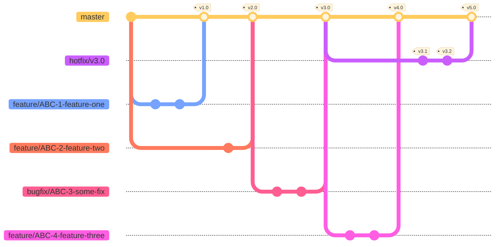

## Git conventions

1. Every branch (excluding rare cases & some tech things) must follow next pattern `prefix/{featureName}`
   Available prefixes:
   - feature (stands for any product story/task/subtask implementation)
   - bugfix
   - tech (tech debts, refactorings, technical improvements)
2. Every commit inside PR should contain explanatory message that describes work done inside every particular commit
3. Squash commit should follow same pattern as branch name (squash is required action)

### Code review

1. Each PR should be assigned to somebody who has the best understanding of particular flow
2. Each PR could be merged only if it has `>= 1` approve
3. Comments and discussions inside PR must be resolved by reporter

---

## Git Branches

### Ongoing work

Pull Requests to `master` branch should be merged using "Squash and merge".

### Illustration 🤩

The following diagram illustrates branching approach

